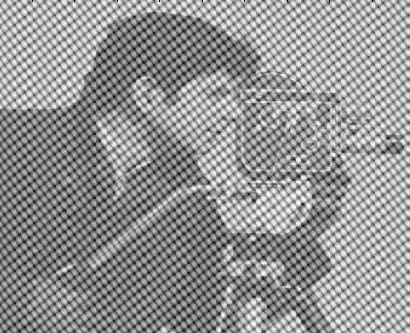
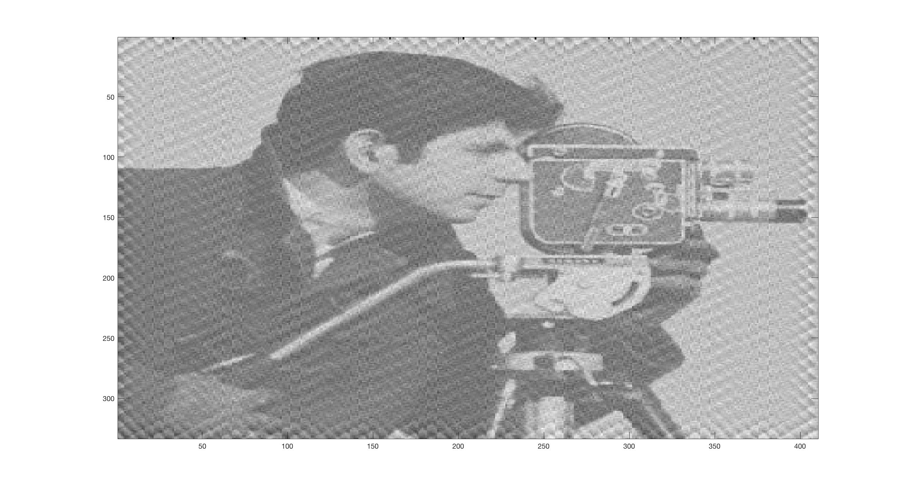
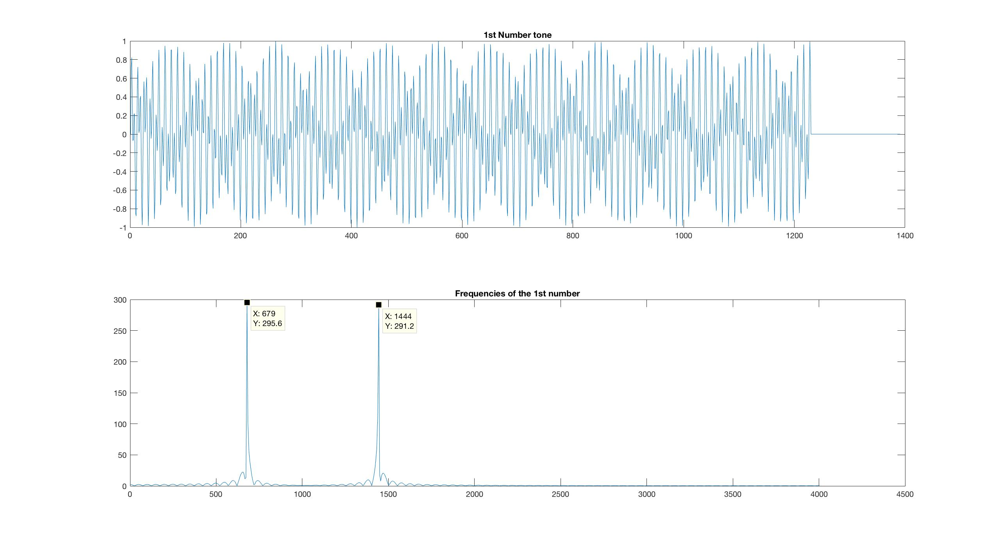
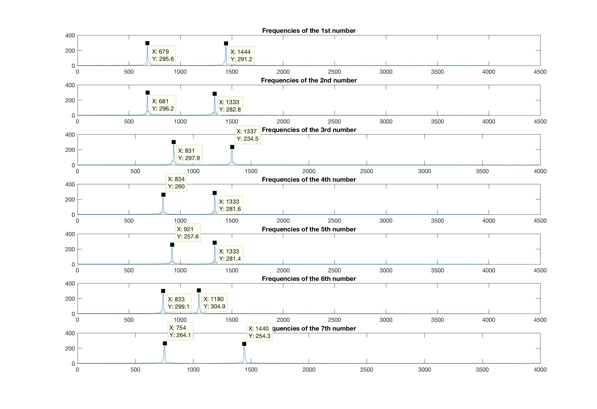

# Digital_image_processing_DFT

### Practicing Fourier Transormation on digital images and sound wave.
This project has two parts:
* Use Fourier Transformation on a blurred image 'Camblurred.jpg' and get rid of the noise in the frequency domain.
Original image:

Processed:

  - The code is mainly contained in:
    - forierCamblurred.m

* Use Fourier Transformation on a phone touch tone sound 'touchtone.wav' to recognize the numbers that are pressed on the frequency domain.
Touch tone and frequency:

Freqency for all numbers:

  - The code mainly contained in:
    - toneDFT.m
    - fourierTouchtone.m
